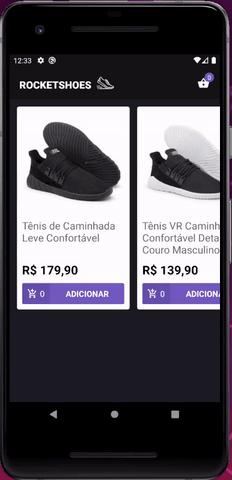

<h1 align="center">
    
   
   
  Bootcamp GoStack Rocketshoes
</h1>

<h3 align="center">
  Arquitetura Flux e React Hooks
</h3>

  <a href="#rocket-sobre-o-projeto">Sobre o projeto</a>&nbsp;&nbsp;&nbsp;|&nbsp;&nbsp;&nbsp;
  <a href="#wrench-ferramentas">Ferramentas</a>&nbsp;&nbsp;&nbsp;|&nbsp;&nbsp;&nbsp;
  <a href="#computer-resultado">Resultado</a>&nbsp;&nbsp;&nbsp;|&nbsp;&nbsp;&nbsp;
  <a href="#memo-license">License</a>

## :rocket: Sobre o projeto

Neste projeto foi criado um **e-commerce** utilizando **ReactJS** para web e **React Native** para mobile. É possível adicionar items ao carrinho, contralar sua quatidade, é feito verificação de estoque entre outras funcionalidades utilizando as tecnologias **Redux** e **Redux Saga**.

O projeto foi feito utilizando redux com classes e num segundo passo, essas classes foram transformadas em funções, utilizando os **Hooks**.

## :wrench: Ferramentas

Dentre diversas ferramentas, as principais foram:

- Redux
- Redux Saga
- React Hooks

## :computer: Resultado

<h1 align="center">
  
</h1>

<h1 align="center">
  
</h1>

## :memo: License

Esse projeto está sob a licença MIT. Veja o arquivo [LICENSE](LICENSE.md) para mais detalhes.

---

Feito com ♥ by Vinicius Faustino Silva :wave: [Get in touch!](https://www.linkedin.com/in/vinícius-silva-019aa0165)
